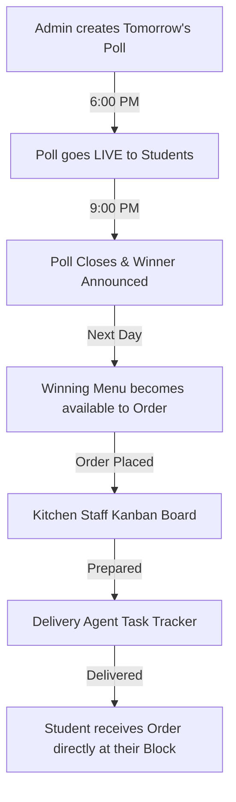
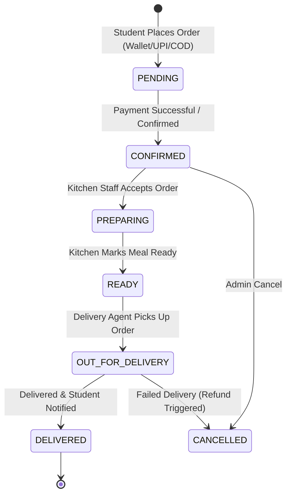
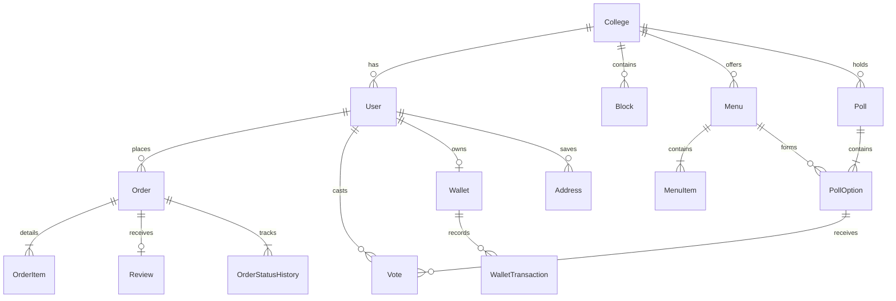

# 🍱 CampusEats: System Architecture & Product Guide

CampusEats is a premium on-campus food delivery and collaborative menu-polling platform built for universities. It combines real-time delivery logistics with a democratic voting mechanism to solve food selection, queues, and kitchen inventory issues at large campus locations.

---

## 🌟 Main Idea & Core Value Proposition

Campus food management is traditionally plagued by long queue times, high food wastage due to unpredictable demand, and poor variety. **CampusEats** addresses these problems through a two-sided marketplace tailored for the university ecosystem:



### 1. Collaborative Menu Polling (The Core Differentiator)
Instead of a static menu that leads to food wastage and student fatigue, the campus kitchen creates a daily poll. Students vote on tomorrow's lunch options. The winning thali/combo is prepared in bulk, ensuring high-quality fresh food, lower preparation costs, and near-zero inventory wastage.

### 2. Micro-Location Campus Delivery
Deliveries are optimized for college blocks (e.g., Hostel Block 6, CSE Block, Library). Using optimized routes and scheduled delivery slots, students get their food delivered directly to their current locations without having to stand in canteen queues between lectures.

### 3. Timetable-Aware Delivery Suggestions
Students can upload their class timetables. The system parses them to automatically suggest delivery locations and slots based on the student's free hours and classroom location.

---

## 👥 User Roles & Permissions

The system operates on four key user roles, each accessing a dedicated dashboard and user flow:

| Role | Core Responsibilities | Main Screens / Modules |
| :--- | :--- | :--- |
| **STUDENT** | Votes on menus, orders food, tops up wallet, tracks orders, reviews meals. | Home Feed, Voting Card, Wallet, Live Tracker, Timetable Upload, Profile |
| **KITCHEN STAFF** | Prepares food, updates order status, manages preparation queues. | Live Kitchen Kanban Board (Incoming, Preparing, Ready) |
| **DELIVERY AGENT** | Accepts deliveries, navigates blocks, updates order progress, tracks earnings. | Rider Task Tracker, Google Maps integration, Earnings Dashboard |
| **ADMIN MANAGER** | Schedules polls, manages menu library, assigns agents, views analytics. | Admin Control Panel, Poll Builder, Menu Creator, Financial & wastage analytics |

---

## 🏗️ Technology Stack

The project is structured as an npm workspaces monorepo:

### 1. Frontend
*   **Framework:** Next.js 14 (App Router)
*   **Styling:** Tailwind CSS + Framer Motion (premium micro-interactions and transitions)
*   **State Management:** Zustand (client state) + React Query (server state synchronization)
*   **Forms:** React Hook Form + Zod verification
*   **Capability:** PWA (Progressive Web App) support for native installation on iOS/Android

### 2. Backend & Database
*   **Runtime:** Node.js
*   **Framework:** Express.js + Socket.io (WebSocket channels for real-time telemetry and updates)
*   **ORM:** Prisma ORM
*   **Database:** PostgreSQL (production standard) / SQLite (zero-dependency local development sandbox)
*   **Background Jobs:** BullMQ with Redis for cron-like scheduling (e.g. closing polls at 9:00 PM)

---

## 🚀 Key Feature Workings & Lifecycles

### 1. Polling System Lifecycle
The daily schedule is automated via backend scheduled worker jobs:

```
  [ 6:00 PM ] ─────────────────► [ 9:00 PM ] ──────────────► [ 9:01 PM ] ─────────────────► [ Next Day ]
Admin schedules poll            Voting closes            Results compiled &           Winning menu becomes
with 4 options. Goes           automatically via         notifications sent to         open for student
live. Notification sent.           BullMQ.               voters with winner.          orders on Home screen.
```

*   **Live Updates:** Vote counts and percentage bars animate in real-time on the student UI using Socket.io updates.
*   **Transparency:** Students can expand details to view anonymized voting breakdowns (e.g., "247 students voted for this combo").

---

### 2. Order Lifecycle & Real-Time Tracking

The status of orders transitions through several strict phases. All updates trigger real-time UI updates for students, kitchen staff, and delivery agents:



*   **Kitchen Board:** Displays order items, order number, elapsed prep timer (color-coded for urgency), and custom kitchen instructions (e.g., "No onion/garlic", "Extra spicy").
*   **Student Tracker:** Displays progress steps and a simplified SVG campus map showing the delivery agent's live position (updated every 30s) and dynamic ETA.

---

### 3. Integrated Wallet System
To speed up transaction times and bypass UPI payment failures during peak ordering hours, the app implements a pre-funded wallet:
*   **Quick Add:** Fixed increments (₹50, ₹100, ₹200, ₹500) or custom amounts via UPI link.
*   **Automated Refunds:** If an order gets cancelled by the kitchen or agent, the refund is instantly credited back to the student's wallet balance.
*   **Referrals & Cashback:** Integrates promotional balances and referral incentives directly into the wallet transaction ledger.

---

### 4. Smart Delivery & Timetable parser
*   **OCR Parsing:** Students drag and drop a PDF or image of their class timetable. The backend processes it using OCR (Google Vision API/Tesseract) to extract their free periods and classroom location blocks.
*   **Smart Autocomplete:** When checkout occurs, the system automatically checks the timetable for the current day and suggests: *"Deliver to CSE Block Room 201 at 12:00 PM (your free period)?"*

---

## 🗄️ Database Schema Outline (Prisma)

A centralized Prisma layout defines entities representing the physical college campus, menus, orders, wallets, and user configurations:



### Core Models
*   **User:** Stores credentials, role (Student/Agent/Kitchen/Admin), verified status, default location metadata.
*   **College & CollegeSettings:** Configures local parameters such as start/end delivery times, poll closing windows, and platform fees.
*   **Block:** Physical points on campus (Academic, Hostel, Cafeteria) for route coordination.
*   **Menu & MenuItem:** Groups recipes, dietary tags (veg/non-veg), allergen details, spice levels, and pricing.
*   **Poll, PollOption & Vote:** Manages the active menu ballot and enforces one-vote-per-user-per-poll constraints.
*   **Order & OrderItem:** Tracks delivery slots, assigned agents, subtotal calculations, payment statuses, and tracking histories.
*   **Wallet & WalletTransaction:** Double-entry ledger tracking balance movements (credits, debits, refunds).
*   **Review:** Star ratings for food quality, delivery speed, and packaging.

---

## 🌐 API & Socket Routes Directory

### REST Endpoints
*   **`/api/auth`**: Send/verify OTP, logins, registration onboarding steps, and sessions.
*   **`/api/users`**: Profile edits, avatar upload, and timetable parsing routes.
*   **`/api/menus`**: Catalog lookup, today's winning menu status, and admin configuration.
*   **`/api/polls`**: Fetch active/past polls, vote casting, and result finalization.
*   **`/api/orders`**: Placement, cancel options, state updates, and delivery slot lookups.
*   **`/api/wallet`**: Balances, top-ups, and ledger listings.
*   **`/api/reviews`**: Star ratings submission and public menu rating aggregations.
*   **`/api/admin/analytics`**: Financial dashboard, order peak hours, food wastage forecasting, and delivery performance metrics.

### WebSocket Events (Socket.io)
*   **`order:status_updated`**: Updates student's live tracking timeline immediately.
*   **`order:agent_location`**: Relays the coordinates and updated ETA of the agent.
*   **`poll:vote_cast`**: Broadcasts live vote updates to update progress bars on student dashboards.
*   **`kitchen:new_order`**: Alerts the kitchen staff instantly of a new incoming order.

---

## 📂 Source Code References

For further details, you can view the core codebase specifications and setup documents:
*   **System Setup & Role Logins:** [README.md](file:///c:/Users/sudha/OneDrive/Desktop/CampusEat/README.md)
*   **Detailed UX & Page Specifications:** [instruction.md](file:///c:/Users/sudha/OneDrive/Desktop/CampusEat/instruction.md)
*   **Detailed System Abstractions & Prisma Schema:** [softwware.md](file:///c:/Users/sudha/OneDrive/Desktop/CampusEat/softwware.md)
